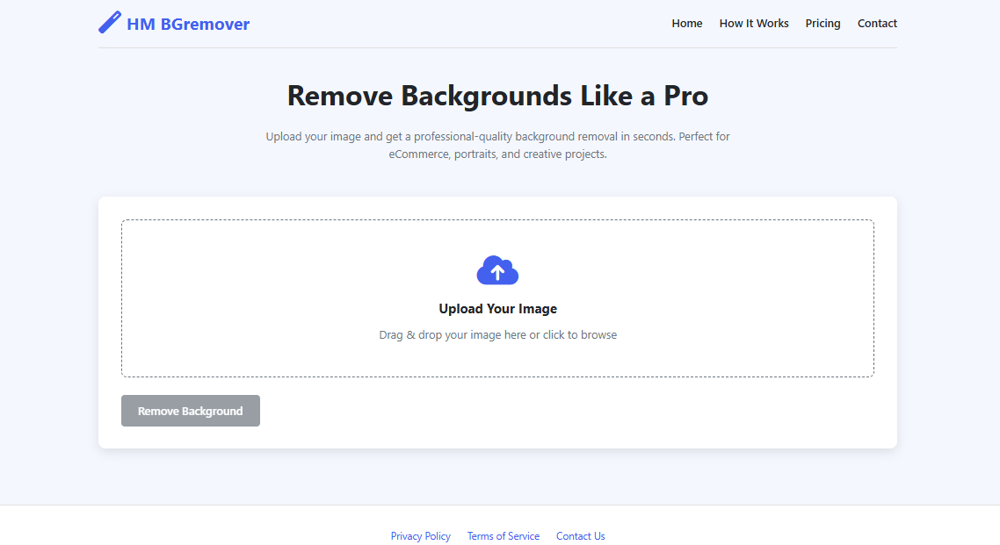

# HM BGremover

**HM BGremover** is a professional online tool for removing backgrounds from images using advanced AI technology. Perfect for eCommerce, portraits, and creative projects.

---

## Screenshots

### Home Page

### Upload & Remove Background

### How it Works

---

## Features

- Simple drag & drop image upload
- Fast, high-quality AI background removal
- Download free sample or HD result (paid)
- Transparent pricing with UPI payment support
- Responsive, modern UI
- Contact form and legal pages included

## How It Works

1. **Upload Your Image**  
   Drag and drop or browse to select your image (JPG, PNG, WEBP supported).

2. **AI Processing**  
   The image is processed using the [remove.bg](https://www.remove.bg/) API for background removal.

3. **Download Results**  
   Preview the result, download a free sample, or pay ₹10 to download the HD version.

## Usage

1. Open `index.html` in your browser.
2. Upload an image.
3. Click **Remove Background**.
4. Download the result as a sample or pay to download the HD version.

## Payment

- UPI payment is supported for HD downloads.
- Enter your UPI transaction ID to verify and unlock the HD image.

## Project Structure

- `index.html` — Main application file (HTML, CSS, JavaScript in one file)
- `screenshots/` — Folder for website screenshots (add your PNG/JPG images here)

## API

This project uses the [remove.bg API](https://www.remove.bg/api) for background removal.  
You can set your API key in the `API_KEY` variable inside `index.html`.

## Customization

- Update the UPI ID in the payment modal as needed.
- Change branding, colors, or pricing in the HTML/CSS as desired.
- Add or update screenshots in the `screenshots/` folder and update the image links above.

## License

This project is for demonstration purposes.  
All rights to the remove.bg API and service belong to their respective owners.

---

&copy; 2025 HM BGremover. All rights reserved.
